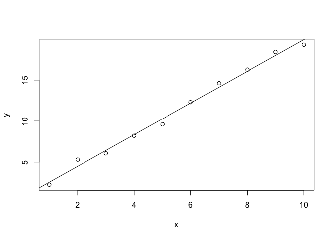

<!-- README.md is generated from README.Rmd. Please edit that file -->

# tester

<!-- badges: start -->
<!-- badges: end -->

The goal of tester is to practise building R packages.

## Installation

Install development version of tester:

``` r
devtools::install_github(...)
```

## Example

``` r
library(tester)
hello("Tommy")
#> [1] "Hello, Tommy it's me!"
```

``` r
x <- 1:10
y <- 2*x+rnorm(10)
m <- lm(y~x)
plot(y~x)
abline(m)
```



`devtools::build_readme()`
